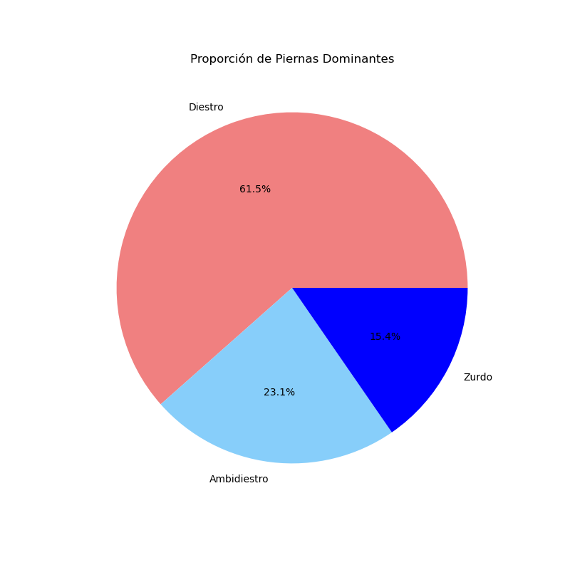

# Analisis-Goleadores-PremierLeague

Este repositorio contiene códigos en python que muestran gŕaficos sobre un archivo de excel que contiene una tabla 
sobre los goleadores de la premier-league desde la temporada 1992-93 hasta la 2022-23, en la tabla vienen datos del jugador como edad, estatura y pierna dominante. Esto con el fin de encontrar relaciones entre los atributos anteriormente mencionados y la cantidad de goles anotados. Si se desea ejecutar estos codigos se necesista instalar pandas:

#### En windows:
```` bash
pip install pandas
````
#### En linux:
```` bash
sudo apt-get install python3-pandas
````

## Conclusiones:

Empezaremos por el apartado de la pierna dominante, solo hay tres: diestro,ambidiestro y zurdo.
En el siguiente gráfico podemos que la mayoría de los goleadores son diestros, después ambidiestros y por último los
zurdos, lo cual es un resultado que ya se esperaba debido a que es más común ser diestro que zurdo.




