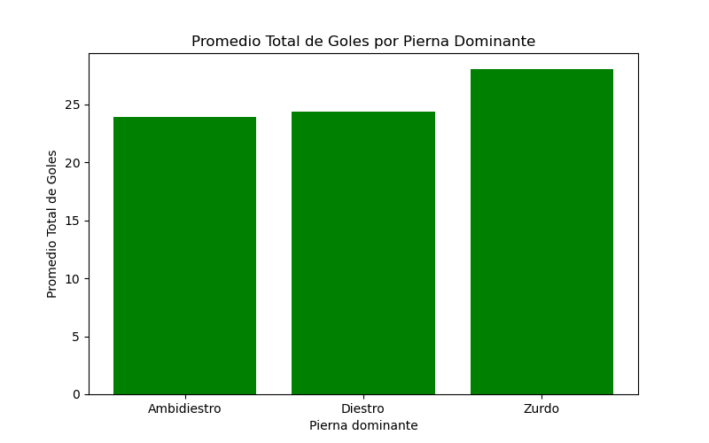
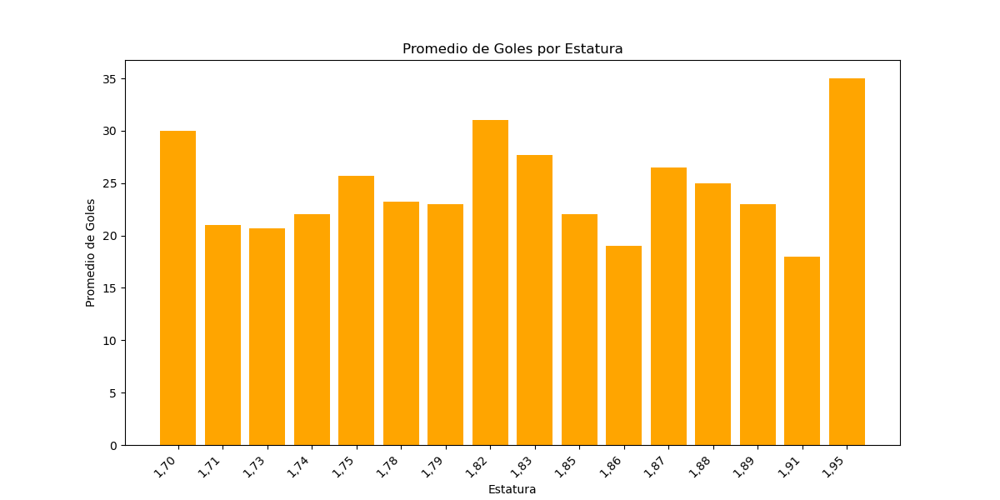
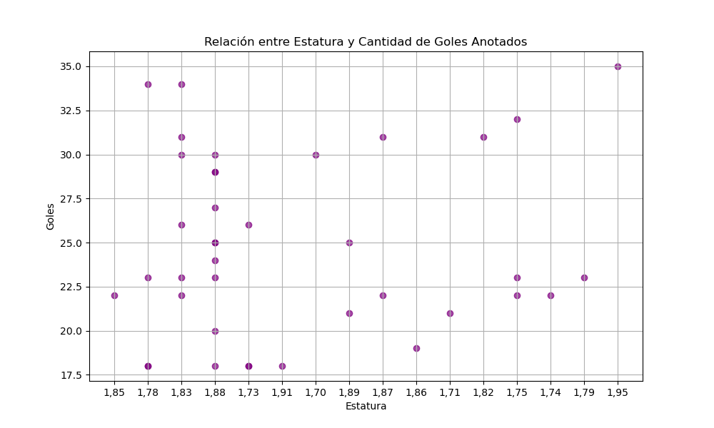
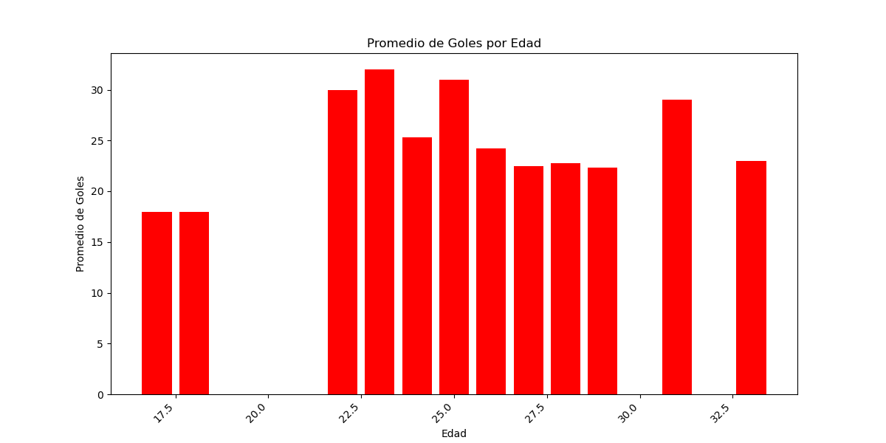
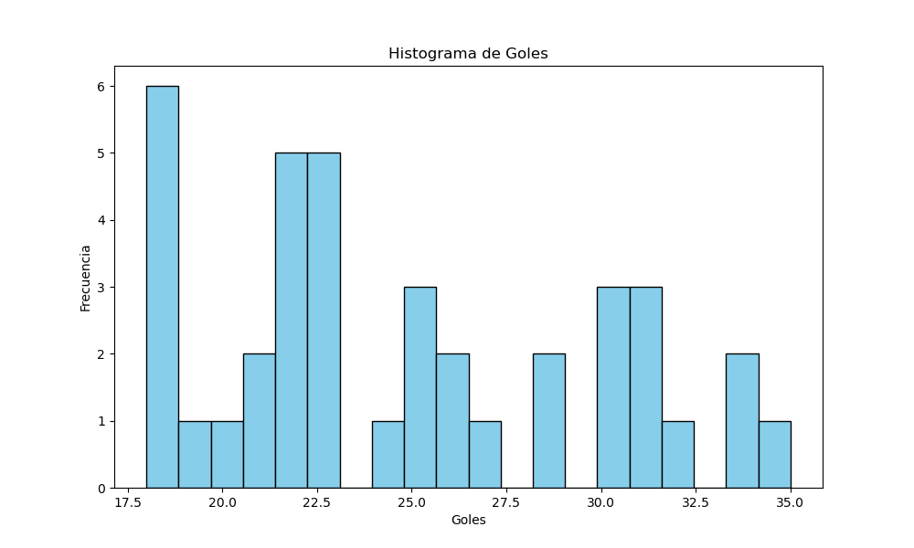

# Analisis-Goleadores-PremierLeague

Este repositorio contiene códigos en python que muestran gŕaficos sobre un archivo de excel que contiene una tabla 
sobre los goleadores de la premier-league desde la temporada 1992-93 hasta la 2022-23, en la tabla vienen datos del jugador como edad, estatura y pierna dominante. Esto con el fin de encontrar relaciones entre los atributos anteriormente mencionados y la cantidad de goles anotados. Si se desea ejecutar estos codigos se necesista instalar pandas:

#### En windows:
```` bash
pip install pandas
````
#### En linux:
```` bash
sudo apt-get install python3-pandas
````

## Conclusiones:

Empezaremos por el apartado de la pierna dominante, solo hay tres: diestro,ambidiestro y zurdo.
En el siguiente gráfico podemos que la mayoría de los goleadores son diestros, después ambidiestros y por último los
zurdos, lo cual es un resultado que ya se esperaba debido a que es más común ser diestro que zurdo.


En el siguiente gráfico de barras nos muestra el promedio de goles por cada pierna dominante, y si nos fijamos bien los zurdos son los que tienen mejor promedio de goles aun siendo una minoría en el gráfico anterior, por lo que
podemos deducir que de los siguientes goleadores de la premier league, los zurdos van a tener mejor promedio de goles.



Continuemos con la estatura, en el siguiente gráfico podemos ver que la cantidad de goles promedio por cada estatura no representa mucha importancia debido a que las barras no tienen algún patrón, sin embargo podemos que no hay goleadores por debajo de la altura de 1.70m y por encima de 1.95, por lo que se puede deducir que los siguientes goleadores de la premier-league no se encontrarán por debajo o arriba de estos rangos.



El siguiente gráfico nos ayuda a identificar la frecuencia de goles por estaturas se puede ver que entre 1.80m y 1.90 se encuentra la mayor cantidad de goleadores.



Continuemos con la edad, podemos ver que el promedio de goles por edades es más alto entre 22 y 29 goles y la mayoría de los goleadores se encuentran en este rango de edad por lo que se puede deducir que los siguientes goleadores se encontraran en estos rangos de edad.



Por lo ultimo una conclusión muy interesante que se puede obtener de la siguiente gráfica es la cantidad de jugadores que anotan cierta cantidad de goles, por ejemplo podemos ver que gran parte de los goleadores anota entre 17 y 28 goles mientras que de 30 en adelante son muy pocos, esto nos da la idea de que es más probable que los siguiente jugadores anoten entre 17 y 28 goles.

